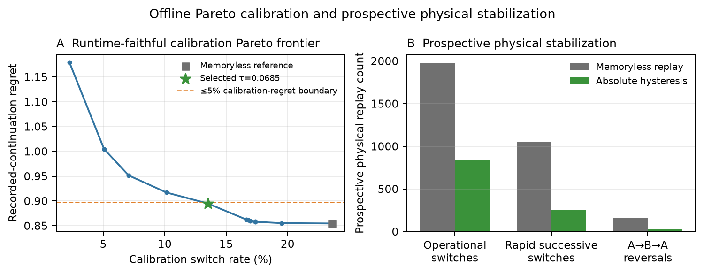
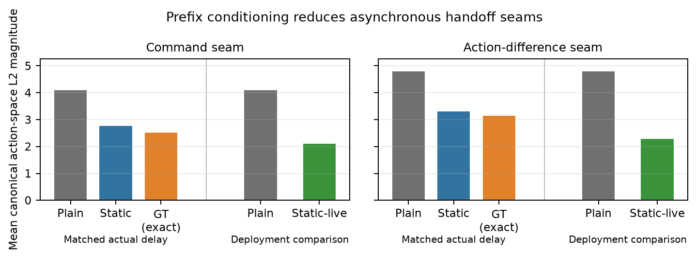

# DreamHandoff
**Stabilizing Reactive Action-Chunk Selection and Asynchronous Bank Transitions**


[DreamChunk (DREAM-Chunk) by Chen et al.](https://arxiv.org/abs/2606.18589) samples multiple action chunks from a policy, imagines their futures with a world model, and reactively selects actions by matching imagined states to the live observation. It also describes asynchronous inference, storing the latent state at policy-request time for the next candidate bank. DreamHandoff implements and adapts this execution pattern with SmolVLA and an adapted R2Dreamer, focusing on candidate selection and the transitions within and between asynchronously generated banks.

[Paper](DreamHandoff.pdf) · [Method details](docs/method.md) · [Reproduction](docs/reproduction.md)

## DreamChunk execution and DreamHandoff adaptation

An **action chunk** is a sequence of proposed actions; each proposed chunk is a **candidate**. A **candidate bank** contains several chunks sampled from one policy observation, while one bank is active during execution. DreamChunk supplies the core mechanism: candidate sampling, latent world-model rollout, phase-aligned matching, and an asynchronous execution scheme in which the next policy request is issued while the current bank continues executing.

DreamHandoff changes how a delayed replacement bank is grounded. Candidates are still generated from the request-time observation, but when inference completes, actions corresponding to the elapsed delay are discarded and the remaining candidate suffixes are imagined from R2Dreamer’s activation-time posterior, which incorporates the observations and executed actions seen during that delay.

DreamChunk reacts by comparing the observation-conditioned live posterior with phase-aligned dreamed candidates. Nearest distance measures coverage; the runner-up gap measures decisiveness. Ranking has some signal, but many gaps are small, making repeated within-bank argmin selection a plausible source of switches; hysteresis tests the stability/reactivity trade-off. During asynchronous inference, the robot acts while the future observation-conditioned selector path is unknown. Rolling that selector forward in the world model instead compares prediction with prediction and can make the followed candidate self-consistent with its own dream. DreamHandoff re-grounds returned suffixes at activation and tests between-bank continuity with prefixes that do not require a predicted switch sequence. The prospective physical capture used plain asynchronous generation; prefix-conditioned variants were reconstructed offline. A supporting activation-time grounding analysis probes this open-loop prediction problem empirically; its comparator-dependent result is reported in [Method details](docs/method.md#activation-time-grounding).

## Main evidence

The frozen study covers one SO-101 rectangle-on-two-pegs task, one SmolVLA policy and R2Dreamer checkpoint, and 24 saved prospective physical episodes. These findings combine the prospective capture with fixed offline analyses; definitions and secondary diagnostics are in [Method details](docs/method.md#evaluation-methodology).

### Candidate ranking

R2Dreamer matching contains measurable but limited candidate-selection information. The nearest dreamed candidate agrees with the best of ten under the **recorded-continuation proxy** on **18.3%** of valid offline rows, above the 10% nominal uniform-choice rate. The proxy compares candidate actions with the next *recorded* robot state. Its best candidate is an oracle only for that factual continuation; unexecuted candidates have no observed counterfactual outcomes. Nearest-to-runner-up matching margins are also small on many operational rows, so this is signal worth using rather than a high-confidence selector. This result does not establish reliable trajectory prediction or improved task success.

### Hysteresis

Hysteresis asks how much stability repeated, sometimes weak-margin selection can gain within a bank, and at what proxy cost. On within-bank transitions in prospective replay, it reduces the candidate switch rate from **17.44% to 7.45%** and A→B→A reversals from **163 to 33**. Stability has a measurable proxy cost: on held-out offline rows, recorded-continuation proxy regret rises by **0.0502** while the switch rate falls from **23.72% to 12.89%**. Prospective matching-distance cost and offline proxy regret are different measures.



### Prefix-conditioned handoffs

Prefix conditioning asks whether a between-bank handoff can stay continuous without knowing the future reactive switch sequence. In the matched-delay offline reconstruction, same-index outgoing-prefix conditioning reduces the mean **command seam** from **4.10 to 2.77** and the mean **action-difference seam** from **4.79 to 3.31**, relative to unguided generation. These are canonical action-space discontinuities, not measurements of physical smoothness. The figure also shows a factual-prefix comparator and a separate deployment-schedule reconstruction; their definitions and scheduling caveats are in [Method details](docs/method.md#prefix-conditioned-handoffs-1).



## Scope and reproduction

The study covers one task, robot family, policy, and world model. It does not demonstrate improved physical task success. Action-space seams do not establish physical smoothness, and the recorded-continuation proxy cannot reveal outcomes for unexecuted candidates. Some comparisons, including prefix conditioning, are offline reconstructions rather than separately collected hardware conditions.

The controller and analyses are in [`src/dream_handoff/`](src/dream_handoff/); frozen settings and artifact identities are in [`configs/`](configs/), with curated outputs in [`results/`](results/) and [`figures/`](figures/). [Method details](docs/method.md) defines the controller, comparators, and metrics. [Reproduction](docs/reproduction.md) gives the immutable repository snapshot, pinned artifacts, hashes, commands, and validation steps. With Python 3.12 and `uv sync --locked --dev`, the publication script `uv run python scripts/reproduce.py` verifies the external artifacts and regenerates the curated outputs using the paths specified there.

## Attribution, citation, and licensing

Candidate sampling, world-model imagination, and phase-aligned selection are due to Chen et al., [*DREAM-Chunk: Reactive Action Chunking with Latent World Model*](https://arxiv.org/abs/2606.18589) (2026). The adapted R2Dreamer source is attributed in [Method details](docs/method.md#r2dreamer-integration).
If you use DreamHandoff in academic work, please cite the accompanying technical report:

```bibtex
@misc{dreamhandoff2026,
  title        = {DreamHandoff: Stabilizing Reactive Action-Chunk Selection and Asynchronous Bank Transitions},
  author       = {Dähn, Paul},
  year         = {2026},
  howpublished = {Technical report},
  note         = {DreamHandoff v1.0.0},
  url          = {https://github.com/pdaehn/dream-handoff}
}
```

DreamHandoff is licensed under [Apache-2.0](LICENSE).
Adapted R2Dreamer components retain their upstream MIT license; see [THIRD_PARTY_NOTICES.md](THIRD_PARTY_NOTICES.md).